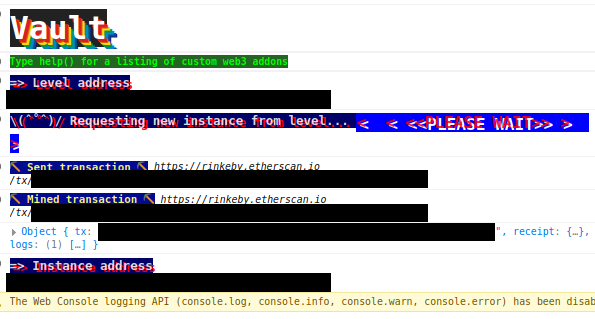
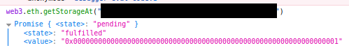
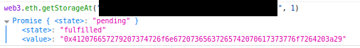
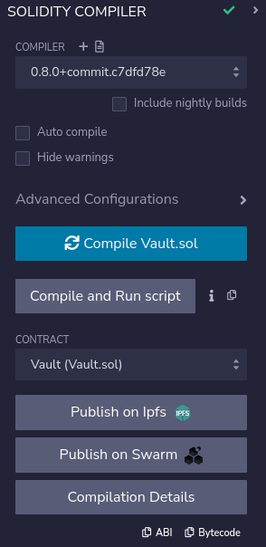
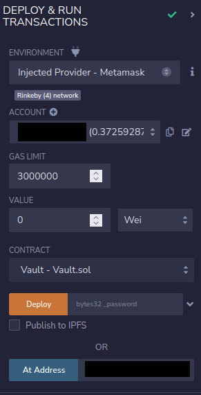
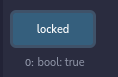
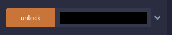
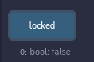

# 08: Vault

The Ethernaut is a Web3/Solidity based wargame inspired by overthewire.org, played in the Ethereum Virtual Machine, in which each level is based on a smart contract that needs to be "hacked".

This is a sample walkthrough for the level called "Vault".

## Setup

First off we need a wallet. Get the Metamask Wallet from https://metamask.io/ and choose whichever network works for you ( in my case i will be using Rinkeby's testnet).
Fund the wallet with Chainlink's faucet https://faucets.chain.link/rinkeby and then click on the button "Get new instance" to deploy the contract.

## Steps for completing the level
Click on F12 to get on Developer Tools. You will get something like this:

Go on Remix: https://remix.ethereum.org/ and make this change in Vault.sol. 

Copy the Vault.sol contract found before "submit instance" and "get new instance" buttons.

At Vault.sol i made this next change:
>- <value> 1. Pragma version from **0.6.0** to **0.8.0**

Before we play with Remix, let's find the password of Vault.sol contract by using Developer Tools.

This level asks us to find the bytes32 password that got initialized in the constructor. Even though the variable is a private one, we can still see it's value in the blockchain and find it by checking it's own storage variables with the function "web3.eth.getStorageAt" function.

Try the function with instance's address:

The number 1 at the final of the input represents the locked variable, which is true from the initialization of the contract : 

Try again the same function with the same instance's address but add "1" after it to check the value of bytes32 password that got stored in the contract:

Now go to Remix and compile the Vault.sol contract:

 Instead of deploying Vault.sol we are going to interact with the already deployed contract by using instance address showed on Developer Tools. Also, dont forget to add your wallet on Environment by selecting "Injected Provider - Metamask".

Check the locked function:

Paste the bytes32 string found before with web3.eth.getStorageAt function in the unlock function:

Check again the locked function :

Wow, congrats!! Now you have managed to unlock the Vault contract and complete this level.

Now finish the level by using the submit button at the bottom of the page.

Congrats! See you on to the next level.:wave: